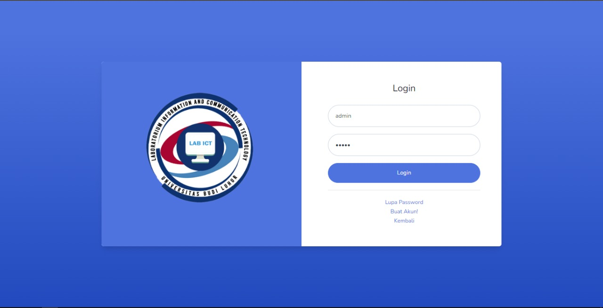

# Web-Penjadwalan-Laravel
Web penjadwalan menggunakan framework laravel
 
framework yang digunakan `laravel` 
 
laravel: 8.83.6

# Fitur
- Tambah;update;hapus;lihat data jadwal, dosen, matkul, ruangan
- Tampilan Home

# Screenshoot

    
Foto Web

     

|  |  |  |
| :---:  | :---:  | :---:  |
|             |                |   
|        |               |  
|          |    |  

  

## Contributors ✨
<table>
  <tr>
    <td align="center"><a href="https://github.com/EriSetyawan166"> <b>Muhammad Eri Setyawan</b></a> <a href="#" title="Code">💻</a> <a href="#" title="Documentation">📖</td>
    <td align="center"><a href="#"> <b>Rafi Zufary Pramanta</b></a> <a href="#" title="Bug reports">🐛</a> <a href="#" title="Ideas, Planning, & Feedback">🤔</a></td>
  </tr>
</table>
